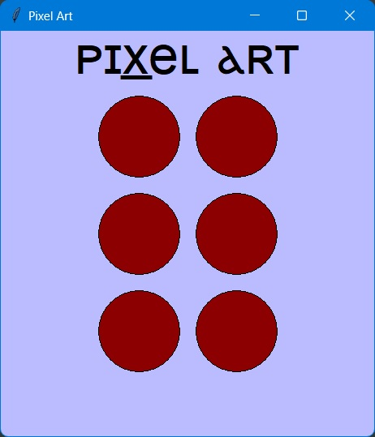
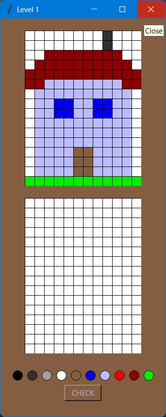

# Pixel Art&nbsp;&nbsp;

This small game is made using [guizero](https://lawsie.github.io/guizero/start/) Python library. It uses App, Window,
Waffle, PushButton and Text widgets.

Python version used: 3.10 
guizero version used: 1.4.0
   

* <big><big>How do I install guizero?</big></big>
<blockquote>
You can simply install guizero by typing in the terminal <code>pip install guizero</code>.
</blockquote>
 

* <big><big>How does it work?</big></big>
<blockquote>
After you press the Run button, tap on a circle to get a level to complete.

Next, select a color from the palette.
Tap on a pixel of the bottom Waffle to paint. Press the CHECK button to finish the level.
</blockquote>

***Also visit my website, [ZCoder.ro](https://zcoder.ro/)***

*from [sebastianzcoder](https://github.com/sebastianzcoder/)*